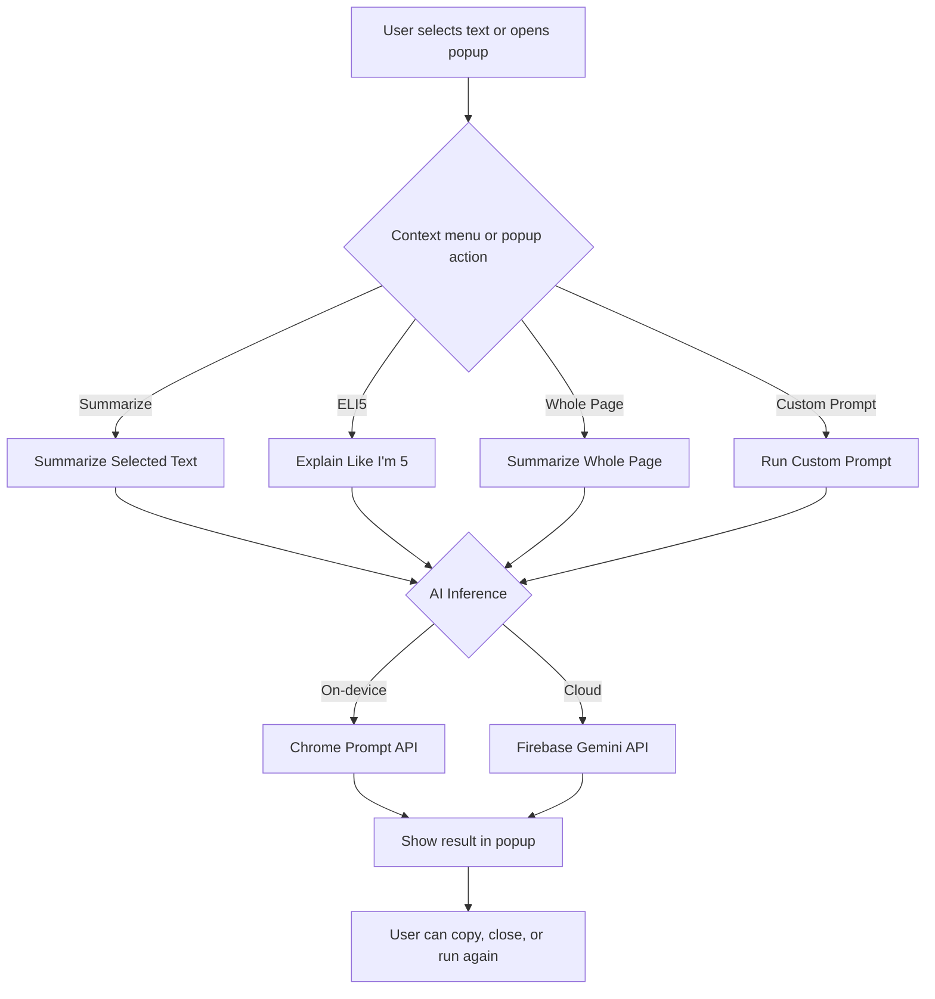

# PromptGenie



> A Chrome extension for instant, in-context text processing powered by hybrid AI (on-device and cloud). Summarize, simplify, or transform any selected text or webpage with a click.

---

## Features

- **Summarize Selected Text**: Right-click context menu or floating action button (FAB) to generate concise summaries of highlighted text.
- **Explain Like I'm 5 (ELI5)**: Instantly simplify complex text into easy-to-understand language.
- **Whole-Page Summarization**: Summarize entire webpages from the extension popup or context menu.
- **Custom Prompts**: Create, manage, and use personalized prompts (e.g., "Turn into bullet points", "Translate to professional English").
- **Floating Action Button (FAB)**: When you select text, a small button appears above the selection for instant access to the active prompt.
- **Dynamic Context Menus**: Context menu updates live as you add or remove prompts.
- **Responsive UI**: Modern, theme-adaptive popup with loading states and result display.
- **Hybrid AI**: Uses Chrome's on-device model for privacy and speed, with seamless fallback to Gemini cloud API for advanced tasks.

---

## Prerequisites

### 1. Chrome & Prompt API Setup (for on-device inference)

**A. Update Chrome**

- Make sure you're using Chrome v139 or higher.
- Go to `chrome://settings/help` and update if needed.

**B. Enable Prompt API for Gemini Nano Multimodal Input**

- Go to: `chrome://flags/#prompt-api-for-gemini-nano-multimodal-input`
- Set to **Enabled** and restart Chrome.

**C. Download the On-Device Model**

1. Open Developer Tools > Console.
2. Run:
   ```js
   await LanguageModel.availability();
   ```
   - If output is `downloadable`, start download:
   ```js
   await LanguageModel.create();
   ```
   - To monitor download progress:
   ```js
   const session = await LanguageModel.create({
     monitor(m) {
       m.addEventListener("downloadprogress", (e) => {
         console.log(`Downloaded ${e.loaded * 100}%`);
       });
     },
   });
   ```
3. Wait until the model is `available` before using the extension for local inference.

---

## Getting Started

### 1. Clone & Install

```bash
git clone https://github.com/discoverlance-com/prompt-genie.git
cd prompt-genie
npm install
```

### 2. Firebase Setup

If you don't already have a Firebase project:

- Go to [Firebase Console](https://console.firebase.google.com/) and create a new project.

Next, enable **AI Logic**:

- In your Firebase project, click on **AI Logic** in the left sidebar.
- Click **Get Started** and follow the prompts. You can choose to use the Gemini Developer API and/or enable AI monitoring.

Create a new Firebase app:

- If you created a new app during the AI Logic setup or you already have a firebase app, then proceed to the step to create the firebase config file.
- In your Firebase project, go to **Project Overview** and click **Add app** (Web, iOS, or Android).
- Copy the app's configuration object.

Create a `.firebase-config.js` file in the root directory with your Firebase app credentials:

```js
export const FIREBASE_CONFIG = {
  apiKey: "YOUR_API_KEY",
  authDomain: "YOUR_DOMAIN",
  projectId: "YOUR_PROJECT_ID",
  // ...other config
};
```

### 3. Build the Extension

```bash
npm run build
# or for production
npm run build:prod
```

### 4. Load in Chrome

1. Open `chrome://extensions`
2. Enable **Developer mode**
3. Click **Load unpacked** and select the `dist` directory

---

## Usage

- **Select text** on any page to reveal a floating action button (FAB) above the selection. Click the FAB to run the active prompt instantly.
- **Right-click** any selected text and choose a prompt from the context menu.
- **Open the popup** to manage custom prompts.
- **Right-click on the whole page** and click on Summarize whole page to summarize the whole page.
- **Add/Delete prompts** in the popup; context menu updates instantly.
- **Results** are shown in a modern, theme-adaptive UI with copy and close actions.

---

## Technical Stack

- **Chrome Extension APIs**: Context menus, storage, scripting, tabs
- **AI Processing**: Firebase Gemini API, Chrome on-device Prompt API
- **CSS**: Open Props, modular theme tokens
- **Bundling**: Webpack

---

## Privacy & Performance

- **Local-only inference** for built-in actions (Summarize, ELI5) for privacy
- **Custom prompts** respect user-defined inference preferences
- **Fast** on-device AI, **powerful** cloud fallback

---

## Contributing

Pull requests and issues are welcome! Please open an issue for feature requests or bug reports.

---

## License

MIT
